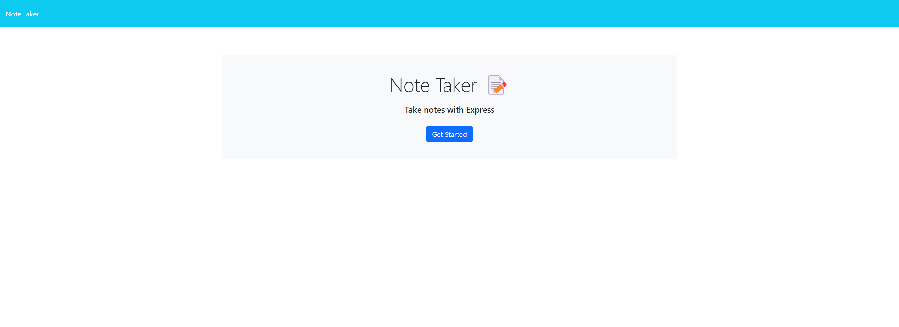
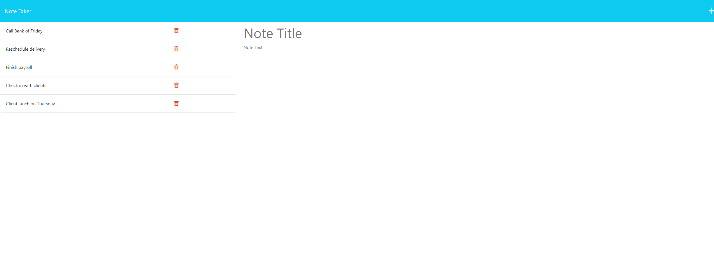

## note-taker

## Description

This is a note taker application that helps you keep track of all of the tasks that you need to complete.

## Table of Contents

- [Description](#Description)
- [Installation](#installation)
- [Walkthrough](Walkthrough)
- [Features](#features)
- [License](#license)
- [Questions and Support](#questions-and-support)

## Installation

To use the note-taker, make sure you have [Node.js](https://nodejs.org/) installed. Then, download or clone this repository to your local machine.

## Website preview

## Features

- Interactive note taker application.
- Ability to add your personal notes.
- Ability to delete your personal notes.

## License

This project is licensed under the MIT license.

## Questions and Support

If you have any questions about the repo or need support, please [open an issue](https://github.com/connorg45/note-taker/issues) or contact me directly at 99grogan@gmail.com.

You can find more of my work at [connorg45](https://github.com/connorg45/).